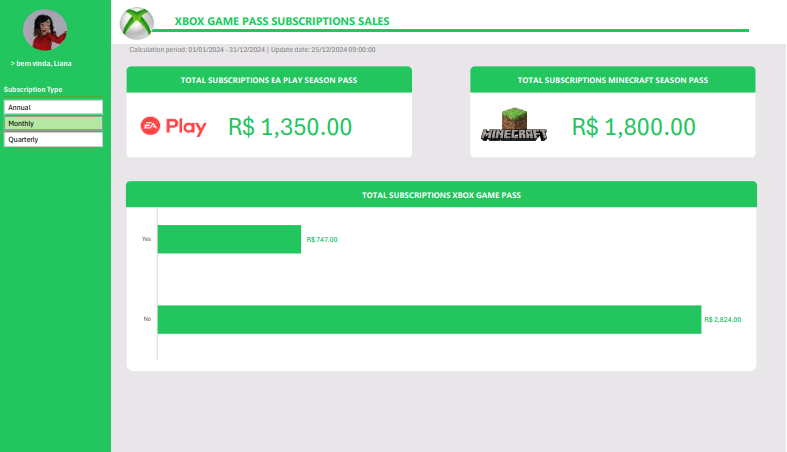

# Dashboard de Vendas Xbox - Desafio DIO

## 📖 Sobre o Projeto
Este projeto foi desenvolvido para o desafio da **DIO (Digital Innovation One)**, com o objetivo de aplicar técnicas de análise de dados e visualização utilizando o Microsoft Excel. O foco principal é transformar dados brutos de assinaturas (Core, Standard e Ultimate) em informações estratégicas para a tomada de decisão.

## 📊 Perguntas de Negócio Respondidas
O Dashboard foi estruturado para sanar as seguintes dúvidas operacionais e financeiras:

1.  **Faturamento Total (Planos Anuais):** Qual o montante gerado pelas vendas de planos com periodicidade anual (agregado).
2.  **Faturamento por Auto-renovação:** Divisão do faturamento de planos anuais entre assinaturas com renovação automática ativa vs. inativa.
3.  **Vendas EA Play:** Total de faturamento vindo do Season Pass da EA Play (exclusivo do plano Ultimate).
4.  **Vendas Minecraft:** Total de faturamento vindo do Minecraft Season Pass.

## 📈 Insights Extraídos
Com base no processamento realizado na aba de **Cálculos**, identificamos:

* **Faturamento EA Play:** R$ 1.350,00 (Exclusivo para assinantes Ultimate).
* **Faturamento Minecraft:** R$ 1.800,00 (Distribuído entre planos Standard e Ultimate).
* **Comportamento de Renovação (Mensal):** Notou-se que o faturamento de clientes que **não** utilizam auto-renovação (R$ 2.824,00) supera significativamente os que utilizam (R$ 747,00) na amostra mensal analisada.

## 🏗️ Estrutura dos Dados
A base de dados (`Bases`) contém informações detalhadas sobre:
- **Subscriber ID:** Identificação única.
- **Plan & Subscription Type:** Tipo de serviço e periodicidade (Mensal, Trimestral, Anual).
- **Auto Renewal:** Status de renovação.
- **Add-ons:** Valores de EA Play e Minecraft Season Pass.
- **Coupon Value:** Descontos aplicados que impactam o valor final.

## 🛠️ Tecnologias Utilizadas
* **Microsoft Excel:** Utilizado para ETL (extração e limpeza), cálculos e visualização.
* **Tabelas Dinâmicas:** Para sumarização eficiente dos dados.
* **Fórmulas de Agregação:** (SOMA, SE, etc) para estruturação de KPIs.

## 🚀 Como Reproduzir
1.  Faça o download do arquivo `Database_Xbox_Sales.xlsx`.
2.  Abra o arquivo no Excel.
3.  As análises estão divididas em:
    * `Bases`: Dados crus.
    * `Cálculos`: Tabelas dinâmicas e lógica de negócio.
    * `Dashboard`: Visualização final com os gráficos.

---
Desenvolvido por **Diego** – Analista de Sistemas.
